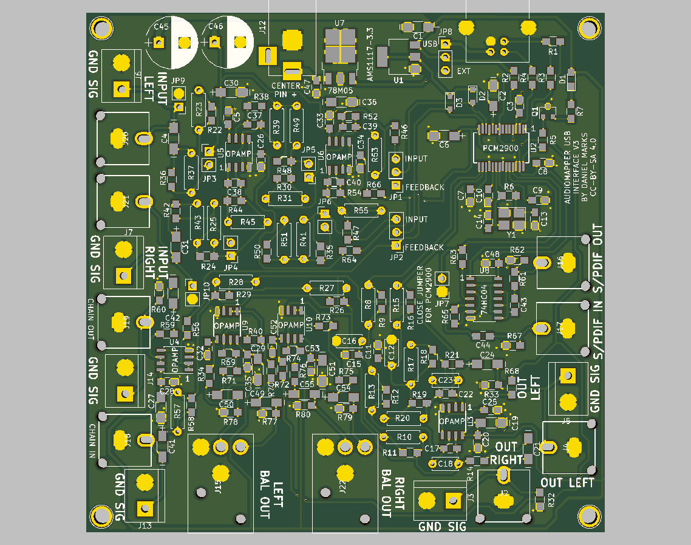

# AudioMapper USB by Daniel Marks

This project is to develop a simple device for characterizing the audio characteristics of a room.  It is intended to be used 

It is based on the PCM2900/PCM2902 TI USB CODEC DAC/ADC.  It has the following features:

- Amplification for two microphone inputs (up to a gain of 125 or 42 dB gain).  The gain stages may be jumpered out if desired to provide a standard line input.
- Phantom power provided to microphone inputs (10 kohm resistor for 5 volts) so that electret or dynamic microphones may be used.
- DAC is 44.1 kHz/48 kHz 16-bit stereo output.
- ADC is 44.1 kHz/48 kHz 16-bit stereo input.
- Can sample the outputs back to the input for synchronizing the audio output signal to the audio input signal.
- Several boards may be chained together to synchronize them.
- A provision for external power input so that the USB power noise (especially USB traffic) does not produce noise on the microphone inputs.  It is recommended that a 9-12 VDC linear power supply is used.
- SPDIF input and outputs.
- Feedback resistors can be surface mount or through hole for easy gain adjustments.

The kicad files and gerbers are provided.  The project is licensed under the Creative Common License, CC-BY-SA 4.0.

